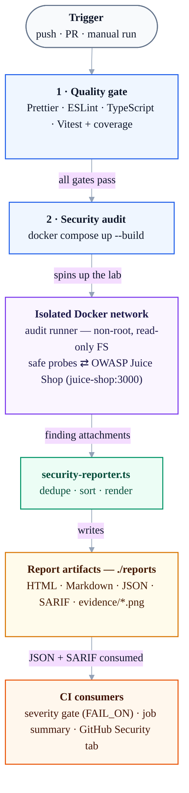

# Playwright Security Automation Lab

[](https://github.com/asaf-1/Penetration-Testing-Juice-shop/actions/workflows/audit.yml)
[](https://github.com/asaf-1/Penetration-Testing-Juice-shop/actions/workflows/codeql.yml)
[](https://playwright.dev/)
[](https://www.docker.com/)
[](https://nodejs.org/)
[](LICENSE)
[](https://owasp.org/www-project-juice-shop/)

Production-grade Playwright infrastructure for a legal, **non-destructive** web
security testing demo. The default workflow runs OWASP Juice Shop and the
Playwright runner together on an isolated internal Docker network, then publishes
findings as HTML, Markdown, JSON, and **SARIF** (GitHub code scanning).

## Engineering highlights

This repository is intentionally built like a real internal security tool, not a
script dump:

- **Isolated, hardened runtime** — Juice Shop and the runner share an `internal`
  Docker network with `read_only` containers, `cap_drop: ALL`,
  `no-new-privileges`, pid/memory limits, and no host port exposure by default.
- **Typed domain model** — a single source of truth for findings
  ([src/findings.ts](src/findings.ts)) shared by the specs and the reporter,
  validated by a published [JSON Schema](schemas/findings.schema.json).
- **Multi-format reporting** — one custom Playwright reporter emits an interactive
  HTML dashboard, Markdown, JSON, and SARIF from the same findings.
- **Code scanning integration** — SARIF upload surfaces findings in the GitHub
  **Security** tab with severity, dedup, and run-to-run tracking.
- **Real quality gates** — Prettier, ESLint (flat config), strict TypeScript,
  and Vitest unit tests with enforced coverage thresholds, all run in CI and on a
  pre-commit hook.
- **Configurable severity gate** — report-only against the intentionally
  vulnerable lab, but able to block a real pipeline via `FAIL_ON`.

## Architecture

The pipeline runs in two CI jobs: a `quality` gate, then an isolated Dockerized
DAST audit whose findings fan out into multiple report formats and CI consumers.

> GitHub renders this diagram natively. In VS Code it shows as code unless you
> install a Mermaid preview extension (e.g. _Markdown Preview Mermaid Support_).



## Safety model

- Tests only target `TARGET_URL`.
- The Docker workflow does not expose Juice Shop to your host network by default.
- Mostly passive (GET, OPTIONS, browser navigation), plus a few bounded **active**
  checks against an authorized lab: throwaway-account registration, a fixed
  failed-login burst, authenticated object-id enumeration, and `/ftp` allowlist
  probes.
- No unbounded brute force, no malware, no data modification, no token forgery or
  replay, no exfiltration of file contents or token values, and no filesystem access
  outside the project artifacts.
- ⚠️ There is no in-code target allowlist yet (see
  [docs/PRODUCTION-READINESS.md](docs/PRODUCTION-READINESS.md), P0). Use only the
  included lab, OWASP Juice Shop, or systems where you have explicit written
  permission. See [docs/SAFETY.md](docs/SAFETY.md) and [SECURITY.md](SECURITY.md).

## Quick start (recommended demo)

```powershell
npm.cmd run docker:audit
```

Outputs are written back to:

- `reports/security-report.html` — interactive security dashboard
- `reports/security-report.md` — formal Markdown summary
- `reports/findings.json` — structured findings payload (matches the JSON Schema)
- `reports/security-report.sarif` — SARIF 2.1.0 for GitHub code scanning
- `reports/evidence/*.png` — repeatable screenshot evidence
- `playwright-report/index.html` — Playwright native execution logs

Stop and clean the compose stack:

```powershell
npm.cmd run docker:down
```

## Local non-Docker demo

```powershell
npm.cmd run lab     # terminal 1: tiny offline target
npm.cmd run audit   # terminal 2: run the suite against it
```

To inspect Juice Shop in a browser while testing:

```powershell
npm.cmd run juice-shop:docker
$env:TARGET_URL = "http://localhost:3000"
npm.cmd run audit
```

## Quality gates & CI

Everything CI enforces runs locally with one command:

```powershell
npm.cmd run verify   # prettier --check + eslint + tsc --noEmit + vitest
```

The [Security Audit Pipeline](.github/workflows/audit.yml) has two jobs:

1. **quality** — formatting, lint, strict typecheck, and unit tests with coverage.
2. **security-audit** — runs the isolated Docker audit, posts a severity summary
   to the GitHub Actions run, uploads SARIF to code scanning, and archives all
   reports as artifacts.

Additional automation:

- [CodeQL](.github/workflows/codeql.yml) static analysis (push, PR, and weekly).
- [Dependabot](.github/dependabot.yml) for npm, GitHub Actions, and Docker.
- A Husky + lint-staged **pre-commit hook** that formats/lints staged files and
  runs typecheck + unit tests.

### Severity gate

By default the pipeline is **report-only** (`FAIL_ON=off`) because the target is
intentionally vulnerable. To make the same tool block a real pipeline, set the
`FAIL_ON` repository variable (or env) to a threshold:

```powershell
$env:FAIL_ON = "High"   # exit non-zero if any High/Critical finding is present
npm.cmd run audit:gate
```

## Coverage of checks

- Target reachability and screenshot evidence
- Security headers: CSP, frame protection, Referrer-Policy, Permissions-Policy, HSTS on HTTPS
- CORS policy review
- Server banner and cache policy review
- Browser-side surface inventory
- Browser form hygiene and external-link `noopener` checks
- Cookie flag hygiene
- Public API discovery and direct unauthenticated API authorization checks
- File listing, sensitive path spot-checks, and `/ftp` download-allowlist /
  null-byte traversal-bypass detection (status and length only — never contents)
- Static asset, source-map, and client bundle secret-hint checks
- Safe input handling probes and a negative authentication workflow
- Authentication token (JWT) hygiene — decode-only inspection of algorithm,
  expiry, and sensitive payload keys
- Login rate-limiting / lockout probe (a bounded, fixed failed-login burst)
- Authenticated basket IDOR/BOLA — read-only object-level authorization check
- Unauthenticated protected-route checks
- Generic error handling and HTTP method advertisement review

The suite is **bounded and non-destructive**. Most checks are passive (browser
navigation, safe GET/OPTIONS, harmless input markers), and a few are deliberately
_active_ against an authorized lab: it registers throwaway accounts, sends a fixed
failed-login burst, enumerates a small object-id range with one authenticated
session, and probes the `/ftp` allowlist. No data is modified, no file contents or
token values are recorded, and tokens are never forged or replayed. See
[docs/SAFETY.md](docs/SAFETY.md) before pointing it at anything.

## Project structure

```text
.github/workflows/audit.yml   CI: quality gates + isolated DAST audit + SARIF upload
.github/workflows/codeql.yml  CodeQL static analysis
.github/dependabot.yml        Dependency update automation
.devcontainer/                Reproducible dev container (Playwright image + Docker-in-Docker)
compose.yaml                  Docker-isolated Juice Shop + Playwright runner
Dockerfile                    Playwright runner image
playwright.config.ts          E2E runner config (testMatch: *.spec.ts)
vitest.config.ts              Unit test + coverage config
eslint.config.mjs             ESLint flat config
tests/juice-shop-security.spec.ts  End-to-end security automation specs
tests/unit/                   Vitest unit tests for the pure logic
src/findings.ts               Shared finding domain model + helpers
src/sarif.ts                  SARIF 2.1.0 mapping for code scanning
src/security-rules.ts         Reusable header/cookie/CORS/path rules
src/reporters/security-reporter.ts  Builds HTML/MD/JSON/SARIF from attachments
src/juice-shop-helpers.ts     Browser helpers and safe text cleanup
src/config.ts                 Environment-driven runtime config
schemas/findings.schema.json  JSON Schema for the findings payload
scripts/check-findings.mjs    Configurable severity gate
scripts/report-summary.mjs    GitHub Actions job-summary generator
scripts/local-lab.mjs         Tiny local demo target for offline verification
docs/PROJECT-STRUCTURE.md     Exhaustive guide to every file, folder, and tool
docs/SAFETY.md                Safety boundaries and operational guidance
docs/PRODUCTION-READINESS.md  Readiness verdict, ratings, and P0/P1/P2 roadmap
docs/GITHUB-CLI.md            gh CLI cheat sheet: status, CI, and PR workflow
```

> For a file-by-file breakdown of the whole repository (what each file does and
> **why** it exists), see **[docs/PROJECT-STRUCTURE.md](docs/PROJECT-STRUCTURE.md)**.

## Command reference

```powershell
npm.cmd install
npm.cmd run setup:browsers   # one-time Playwright Chromium download
npm.cmd run verify           # format check + lint + typecheck + unit tests
npm.cmd run coverage         # unit tests + V8 coverage (thresholds enforced)
npm.cmd run audit            # run the suite against TARGET_URL
npm.cmd run docker:audit     # full isolated end-to-end audit
npm.cmd run audit:summary    # render the findings summary
npm.cmd run audit:gate       # apply the FAIL_ON severity gate
npm.cmd run report           # open the Playwright HTML report
```

## License

[MIT](LICENSE) — for authorized, educational, and defensive security use only.
